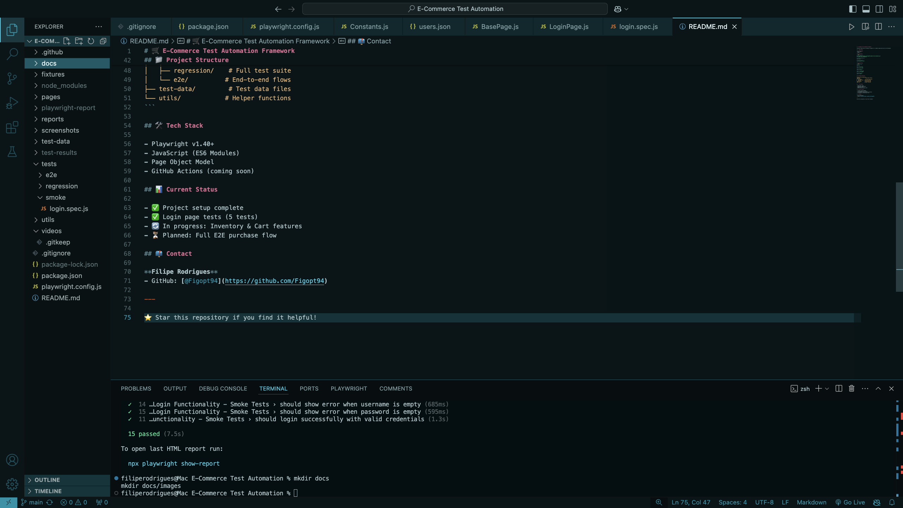
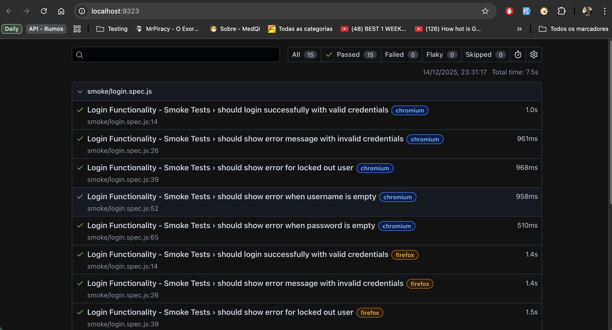
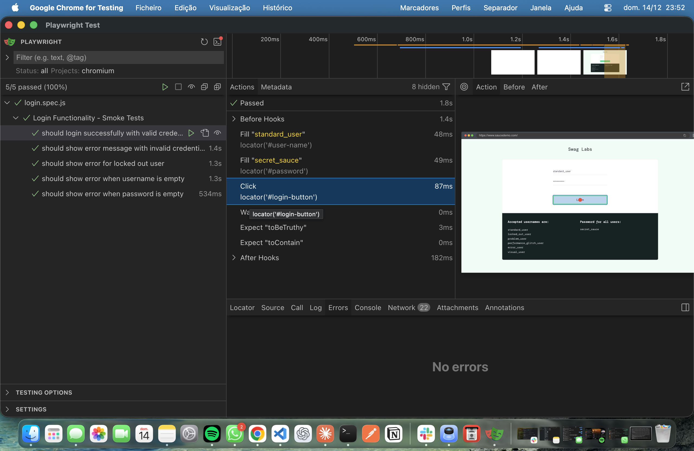

# 🛒 E-Commerce Test Automation Framework


Production-ready E2E test automation framework for e-commerce applications built with Playwright.

## 🎯 Overview

This framework demonstrates enterprise-level test automation practices including:
- Page Object Model architecture
- Data-driven testing  
- Parallel execution across browsers
- Comprehensive CI/CD integration
- Detailed HTML reporting

**Application Under Test:** [SauceDemo](https://www.saucedemo.com/)

## 🚀 Quick Start

### Prerequisites
- Node.js 18+
- npm 9+

### Installation
```bash
# Clone repository
git clone https://github.com/Figopt94/Ecommerce-test-automation.git
cd Ecommerce-test-automation

# Install dependencies
npm install

# Install browsers
npx playwright install
```

### Running Tests
```bash
# Run all tests
npm test

# Run smoke tests
npm run test:smoke

# Run with UI mode
npm run test:ui

# Run in headed mode
npm run test:headed

# Generate report
npm run report
```

## 📸 Screenshots

### ✅ Test Execution

*All 5 smoke tests passing successfully*

### 📊 HTML Report

*Detailed test execution report with timing and traces*

### 🎨 Playwright UI Mode

*Interactive test debugging and exploration interface*

---

## 📁 Project Structure
```
ecommerce-test-automation/
├── pages/              # Page Object Models
├── tests/
│   ├── smoke/         # Critical path tests
│   ├── regression/    # Full test suite
│   └── e2e/          # End-to-end flows
├── test-data/         # Test data files
└── utils/            # Helper functions
```

## 🛠️ Tech Stack

- **Framework:** Playwright v1.40+
- **Language:** JavaScript (ES6 Modules)
- **Pattern:** Page Object Model
- **CI/CD:** GitHub Actions
- **Reporting:** HTML Reports, Traces, Screenshots

## 📊 Current Status

- ✅ Project setup complete
- ✅ Base framework architecture (POM)
- ✅ Login functionality (5 tests passing)
- ✅ CI/CD pipeline (GitHub Actions)
- 🔄 In progress: Inventory & Cart features
- ⏳ Planned: Complete E2E purchase flow

## 📫 Contact

**Filipe Rodrigues**
- GitHub: [@Figopt94](https://github.com/Figopt94)
- LinkedIn: (https://www.linkedin.com/in/filipe-caldevilla-rodrigues-07372b1b3/)

---

⭐ Star this repository if you find it helpful!