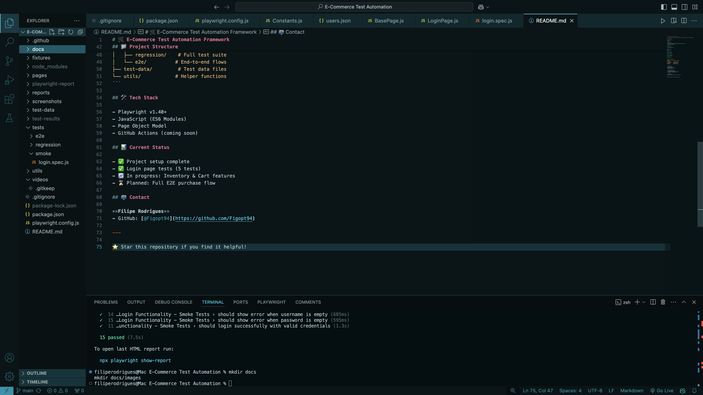
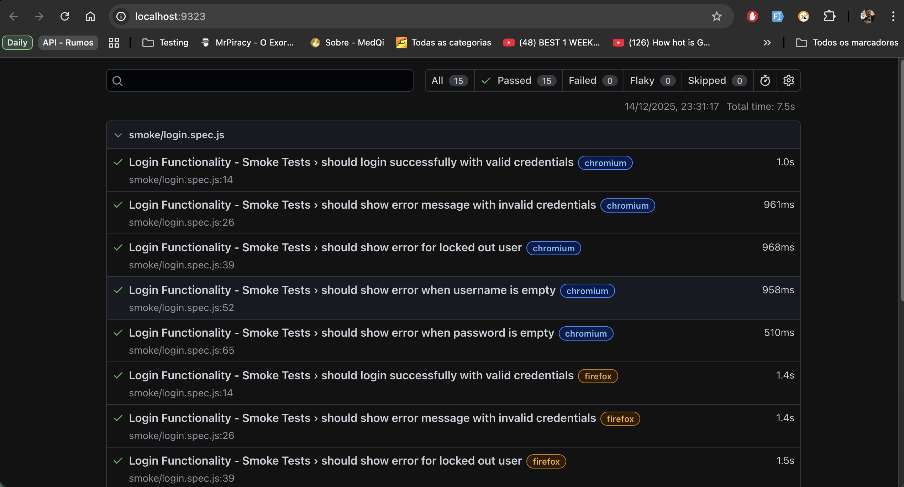
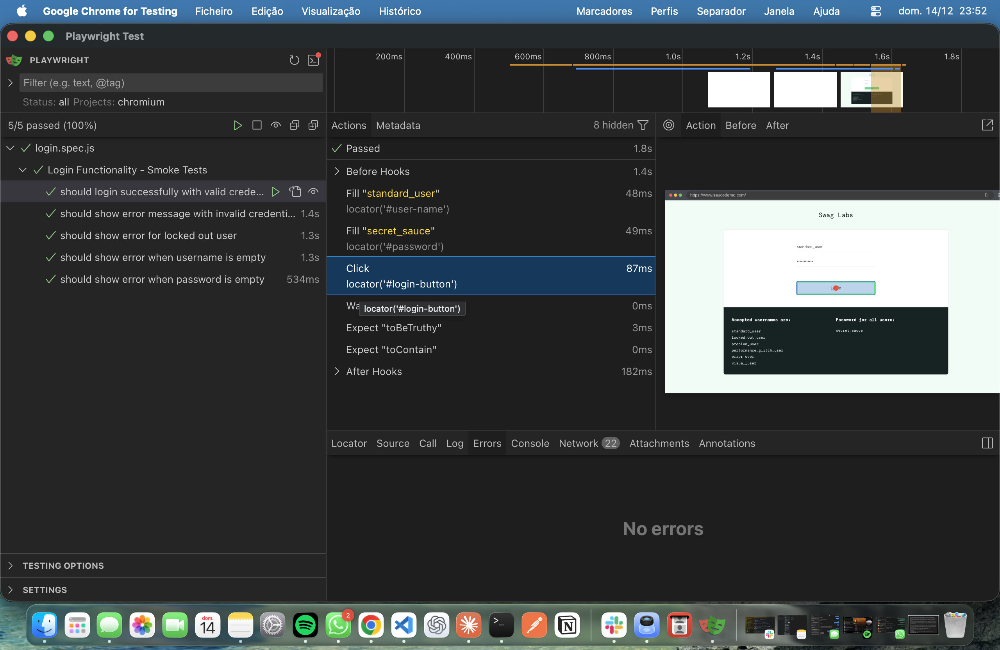

# 🛒 E-Commerce Test Automation Framework


[](https://github.com/Figopt94/Ecommerce-test-automation/actions/workflows/playwright-tests.yml)


Production-ready end-to-end test automation framework for e-commerce applications built with Playwright and JavaScript.

## 🎯 Overview

This framework demonstrates enterprise-level test automation best practices:

- ✅ **Page Object Model (POM)** - Maintainable and scalable architecture
- ✅ **Data-Driven Testing** - JSON-based test data management
- ✅ **Cross-Browser Testing** - Chromium, Firefox, and WebKit
- ✅ **Parallel Execution** - Optimized test performance
- ✅ **CI/CD Integration** - Automated testing with GitHub Actions
- ✅ **Comprehensive Reporting** - HTML reports, traces, and screenshots
- ✅ **100% Test Pass Rate** - Reliable and stable test suite

**Application Under Test:** [SauceDemo](https://www.saucedemo.com/)

---

## 📊 Test Coverage

| Suite | Tests | Status | Coverage |
|-------|-------|--------|----------|
| **Smoke Tests** | 5 | ✅ Passing | Critical user paths |
| **Regression Tests** | 30 | ✅ Passing | Full functionality |
| **E2E Tests** | 4 | ✅ Passing | Complete user journeys |
| **Total** | **35** | **100%** | **105 executions** (3 browsers) |

### Test Scenarios

**Authentication (5 tests)**
- ✅ Valid user login
- ✅ Invalid credentials handling
- ✅ Locked user validation
- ✅ Empty field validation
- ✅ Error message verification

**Inventory Management (10 tests)**
- ✅ Product listing display
- ✅ Add to cart functionality
- ✅ Remove from cart
- ✅ Multiple product handling
- ✅ Cart badge counter
- ✅ Product sorting (A-Z, Z-A)
- ✅ Price sorting (Low-High, High-Low)
- ✅ Navigation flows
- ✅ Logout functionality

**Cart (10 tests)**
- ✅ Navigate to cart page
- ✅ Empty cart validation
- ✅ Single product display
- ✅ Multiple products display
- ✅ Correct item quantity
- ✅ Correct item price
- ✅ Remove item from cart
- ✅ Update cart after removal
- ✅ Continue shopping navigation
- ✅ Proceed to checkout navigation

**Checkout Flow (13 tests)**
- ✅ Navigate to checkout step one
- ✅ Error on empty fields
- ✅ Error on missing first name
- ✅ Error on missing last name
- ✅ Error on missing zip code
- ✅ Proceed to order overview
- ✅ Items displayed in overview
- ✅ Correct subtotal
- ✅ Tax display
- ✅ Total includes tax
- ✅ Complete order successfully
- ✅ Back to inventory after order
- ✅ Cancel checkout

**E2E Purchase Flow (4 tests)**
- ✅ Full purchase with single product
- ✅ Full purchase with multiple products
- ✅ Purchase and return for new purchase
- ✅ Sort products then purchase

---

## 🚀 Quick Start

### Prerequisites

- **Node.js** 18.0 or higher
- **npm** 9.0 or higher

### Installation
```bash
# Clone repository
git clone https://github.com/Figopt94/Ecommerce-test-automation.git
cd Ecommerce-test-automation

# Install dependencies
npm install

# Install Playwright browsers
npx playwright install
```

### Running Tests
```bash
# Run all tests
npm test

# Run smoke tests only
npm run test:smoke

# Run regression tests only
npm run test:regression

# Run tests in headed mode (see browser)
npm run test:headed

# Run tests in UI mode (interactive)
npm run test:ui

# Run tests in debug mode
npm run test:debug

# Run on specific browser
npm run test:chromium
npm run test:firefox
npm run test:webkit

# Generate and view HTML report
npm run report
```

---

## 📸 Screenshots

### ✅ Test Execution

*All 45 test executions passing across 3 browsers*

### 📊 HTML Report

*Detailed test execution report with timing, traces, and failure analysis*

### 🎨 Playwright UI Mode

*Interactive test debugging and development interface*

---

## 📁 Project Structure
```
ecommerce-test-automation/
├── .github/
│   └── workflows/
│       └── playwright-tests.yml    # CI/CD pipeline
├── docs/
│   └── images/                     # Documentation screenshots
├── pages/                          # Page Object Models
│   ├── BasePage.js                # Base class with common methods
│   ├── LoginPage.js               # Login page object
│   ├── InventoryPage.js           # Inventory page object
│   ├── CartPage.js                # Cart page object
│   └── CheckoutPage.js            # Checkout pages object (step 1, 2 & complete)
├── tests/
│   ├── smoke/                     # Critical path tests
│   │   └── login.spec.js
│   ├── regression/                # Full regression suite
│   │   ├── inventory.spec.js
│   │   ├── cart.spec.js
│   │   └── checkout.spec.js
│   └── e2e/                       # End-to-end scenarios
│       └── purchase_flow.spec.js
├── test-data/
│   ├── users.json                 # Test user credentials
│   └── checkout.json              # Checkout form test data
├── utils/
│   └── Constants.js               # Application constants
├── reports/                        # Test execution reports
├── screenshots/                    # Failure screenshots
├── videos/                         # Test execution videos
├── .gitignore
├── package.json
├── playwright.config.js           # Playwright configuration
└── README.md
```

---

## 🛠️ Tech Stack

| Technology | Version | Purpose |
|------------|---------|---------|
| **Playwright** | 1.57.0 | Test automation framework |
| **JavaScript** | ES6+ | Programming language |
| **Node.js** | 18+ | Runtime environment |
| **GitHub Actions** | - | CI/CD pipeline |
| **Allure** | - | Advanced reporting (planned) |

---

## 🏗️ Architecture

### Page Object Model (POM)

The framework uses the Page Object Model design pattern for better maintainability:
```javascript
// Example: LoginPage.js
export class LoginPage extends BasePage {
    constructor(page) {
        super(page);
        this.usernameInput = '#user-name';
        this.passwordInput = '#password';
        this.loginButton = '#login-button';
    }

    async login(username, password) {
        await this.page.fill(this.usernameInput, username);
        await this.page.fill(this.passwordInput, password);
        await this.page.click(this.loginButton);
    }
}
```

### Key Design Principles

1. **Separation of Concerns** - Page objects contain locators and actions; tests contain assertions
2. **Reusability** - Common methods in BasePage shared across all page objects
3. **Maintainability** - Locator changes only need updates in one place
4. **Readability** - Tests read like user stories

---

## ⚙️ Configuration

### Playwright Config Highlights
```javascript
// playwright.config.js
{
  timeout: 30000,
  retries: process.env.CI ? 2 : 0,
  workers: process.env.CI ? 1 : undefined,
  use: {
    baseURL: 'https://www.saucedemo.com',
    screenshot: 'only-on-failure',
    video: 'retain-on-failure',
    trace: 'on-first-retry'
  },
  projects: [
    { name: 'chromium' },
    { name: 'firefox' },
    { name: 'webkit' }
  ]
}
```

### Environment Variables

Create `.env` file (optional):
```env
BASE_URL=https://www.saucedemo.com
HEADLESS=true
SLOW_MO=0
```

---

## 🔄 CI/CD Pipeline

### GitHub Actions Workflow

The project includes automated testing on every push and pull request:

- ✅ Runs on Ubuntu latest
- ✅ Tests all 3 browsers in parallel
- ✅ Uploads test reports and artifacts
- ✅ Scheduled daily runs at 2 AM UTC
- ✅ Fail-fast disabled for comprehensive results

**View workflow:** [.github/workflows/playwright-tests.yml](.github/workflows/playwright-tests.yml)

**View results:** [GitHub Actions](https://github.com/Figopt94/Ecommerce-test-automation/actions)

---

## 📈 Test Reports

### HTML Report

Playwright generates a comprehensive HTML report after each test run:
```bash
npm run report
```

**Features:**
- Test execution timeline
- Failure screenshots
- Video recordings
- Trace viewer
- Step-by-step execution log

### Viewing Reports Locally

After running tests:
```bash
npx playwright show-report
```

---

## 🧪 Writing Tests

### Example Test
```javascript
import { test, expect } from '@playwright/test';
import { LoginPage } from '../../pages/LoginPage.js';
import users from '../../test-data/users.json' assert { type: 'json' };

test.describe('Login Tests', () => {
    let loginPage;

    test.beforeEach(async ({ page }) => {
        loginPage = new LoginPage(page);
        await loginPage.goto();
    });

    test('should login with valid credentials', async () => {
        await loginPage.login(
            users.validUser.username,
            users.validUser.password
        );
        expect(await loginPage.isLoginSuccessful()).toBeTruthy();
    });
});
```

---

## 🐛 Debugging

### Debug Mode
```bash
# Run in debug mode with Playwright Inspector
npm run test:debug

# Run specific test in debug mode
npx playwright test tests/smoke/login.spec.js --debug
```

### UI Mode (Recommended)
```bash
# Interactive test development and debugging
npm run test:ui
```

### Trace Viewer

View detailed execution traces:
```bash
npx playwright show-trace trace.zip
```

---

## 📊 Current Development Status

### ✅ Completed
- [x] Project setup and configuration
- [x] Base framework architecture (POM)
- [x] Login functionality (5 tests)
- [x] Inventory management (10 tests)
- [x] Cart functionality (10 tests)
- [x] Checkout flow (13 tests)
- [x] Complete E2E purchase flow (4 tests)
- [x] Cross-browser testing
- [x] CI/CD pipeline
- [x] Comprehensive documentation
- [x] Test data management

### ⏳ Planned
- [ ] API testing integration
- [ ] Performance testing
- [ ] Visual regression testing
- [ ] Allure reporting
- [ ] Docker containerization

---

## 🤝 Contributing

Contributions are welcome! This is a portfolio project, but suggestions and improvements are appreciated.

### Development Workflow

1. Fork the repository
2. Create a feature branch (`git checkout -b feature/amazing-feature`)
3. Commit your changes (`git commit -m 'feat: add amazing feature'`)
4. Push to the branch (`git push origin feature/amazing-feature`)
5. Open a Pull Request

### Commit Convention

This project follows [Conventional Commits](https://www.conventionalcommits.org/):

- `feat:` New feature
- `fix:` Bug fix
- `docs:` Documentation changes
- `test:` Test additions or modifications
- `refactor:` Code refactoring
- `chore:` Maintenance tasks
- `ci:` CI/CD changes

---

## 📝 License

This project is licensed under the MIT License - see the [LICENSE](LICENSE) file for details.

---

## 📫 Contact

**Filipe Rodrigues**

- 🔗 GitHub: [@Figopt94](https://github.com/Figopt94)
- 💼 LinkedIn: [Filipe Caldevilla Rodrigues](https://www.linkedin.com/in/filipe-caldevilla-rodrigues-07372b1b3/)

---

## 🏆 Acknowledgments

- **Playwright Team** - For the amazing testing framework
- **SauceDemo** - For providing a reliable test application
- **GitHub Actions** - For seamless CI/CD integration

---

## 📚 Resources

- [Playwright Documentation](https://playwright.dev/)
- [Page Object Model Pattern](https://playwright.dev/docs/pom)
- [Best Practices](https://playwright.dev/docs/best-practices)
- [GitHub Actions Guide](https://docs.github.com/en/actions)

---

⭐ **If you find this project helpful, please consider giving it a star!**

---

*Last updated: December 15, 2025*